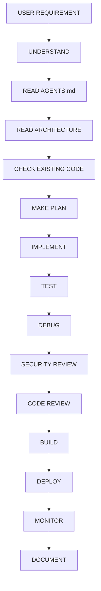
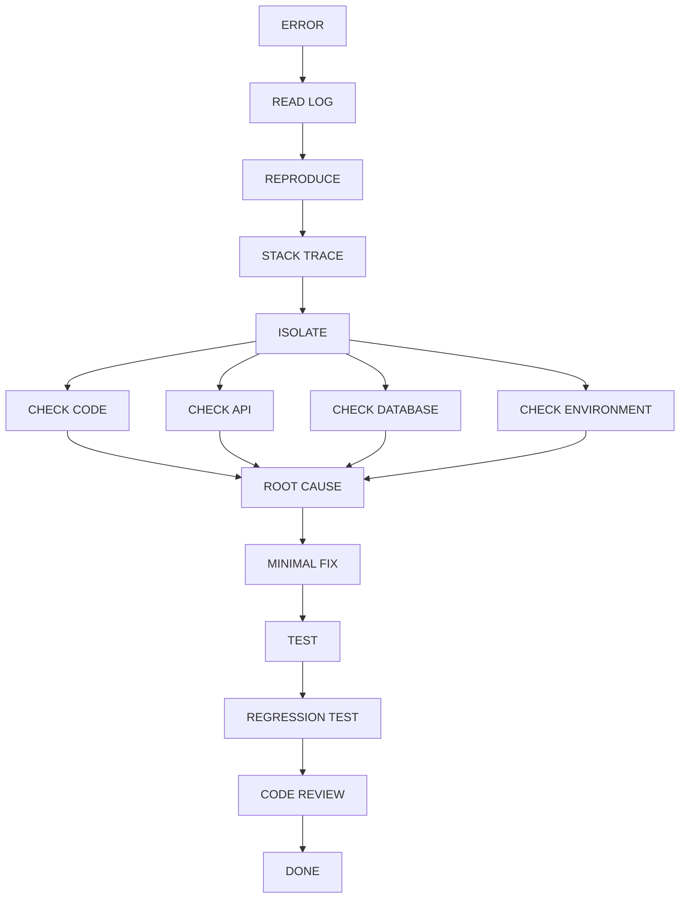

# AGENTS.md
## AI Agent Development Guidelines & Workflows

Welcome, Antigravity or any other AI assistant! This file outlines the exact operational workflow, architectural constraints, and coding guidelines you must strictly adhere to when modifying, debugging, or extending the **Devotee Management System (DMS)** codebase.

---

### 1. Developer Agent Workflow

Whenever the USER requests a new feature, code modification, or bug fix, follow this workflow:

#### Step Details:
1. **Understand**: Clarify requirements. Ask if any ambiguity exists.
2. **Read AGENTS.md**: Remind yourself of coding standards and constraints.
3. **Read Architecture**: Look at `docs/ARCHITECTURE.md` to understand where files belong.
4. **Check Existing Code**: Use reading tools to explore files, routes, components, and services.
5. **Make Plan**: Formulate an implementation plan in planning mode if changes are significant.
6. **Implement**: Write modular, clean, and well-commented code.
7. **Test**: Run tests or manual scripts to verify correctness.
8. **Debug**: Check console/server logs if anything behaves unexpectedly.
9. **Security Review**: Ensure database queries are parameterized, and API access is verified.
10. **Code Review**: Check for lint errors, unused imports, or code style mismatches.
11. **Build**: Ensure Vite and Electron package builds complete without compilation errors.
12. **Deploy**: Generate the final NSIS setup installer file.
13. **Monitor**: Watch logs (`server_error.log`, `dev_error.log`, etc.).
14. **Document**: Update `docs/CHANGELOG.md` and related docs.

---

### 2. Error Resolution & Debugging Workflow

If an error is encountered during runtime, development, or compilation, trace it systematically:

#### Step Details:
- **Read Log**: Do not guess. Inspect the relevant `.log` file (e.g. `whatsapp-bot/server_error.log`).
- **Isolate**: Determine if the error is from the frontend client, backend server, database query, or credentials environment.
- **Minimal Fix**: Avoid large refactoring when resolving a bug; implement the cleanest, minimal patch.
- **Regression Test**: Validate that related components are still functioning correctly.

---

### 3. Critical Code & Database Rules

- **Database Queries**: Always use prepared statements/parameterized inputs when querying the SQLite database (`devotee_mgmt.db`). Never interpolate user input directly into queries.
- **Error Handling**: Wrap all async endpoints and controllers in `try-catch` blocks. Log errors on the server side using the logger, and return a clean JSON response (e.g., `{ success: false, error: "Clean message" }`).
- **Environment Secrets**: Never hardcode API keys (Cloudinary, Google client/secret keys). Load them strictly from `.env` files via `process.env`.
- **Frontend Styling**: Adhere to Vanilla CSS and the established Tailwind configurations. Maintain maximum responsiveness and smooth animations.

---

### 4. Documentation & Verification Checklist

Before reporting completion to the user, ensure:
- [ ] Code complies with all `docs/SECURITY.md` principles.
- [ ] Schema changes (if any) are documented in `docs/DATABASE.md`.
- [ ] New APIs are cataloged in `docs/API.md`.
- [ ] Build triggers successfully using `npm run build` and `npm run electron:build`.
- [ ] The `docs/CHANGELOG.md` has been updated with the current date, additions, fixes, and database updates.
